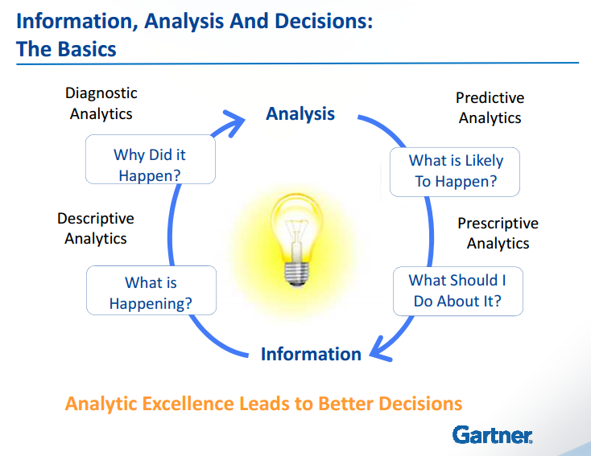

# Big Data Analytics

## Types of Analytics
1. Descriptive Analytics (What is Happening?)
2. Diagnostic Analytics (Why Did it Happen?)
3. Predictive Analytics (What is Likely To Happen?)
4. Prescriptive Analytics (What Should I Do About It?)

[1]
[2]

## Descriptive analytics
Descriptive analytics helps you understand the current state of affairs in an organization. It lets you look at *what is happening today* and *what has happened in the past*. This type of analytics typically provides summarized information to understand currently existing sales patterns or customer behavior, customer profitability, past competitor actions, etc. 

Specific techniques might include simple box plots, histogram charts with means, minimums, and maximums. Plotting the data in quartiles or deciles across a number of different variables. Or computing statistical measures like mean, mode, standard deviation, etc. 

Descriptive analytics is very powerful for *understanding the current state of affairs* and for *developing the hypothesis* to anticipate where business problems and opportunities may lie. It helps us answer the question, what happened? [3]

## Diagnostic analytics
Diagnostic analytics helps you understand why it happened. It provides the reasons for what happened in the past. This type of analytics typically tries to *go deeper into a specific reason or hypotheses* based on the descriptive analytics.

While descriptive analytics cast a wide net to understand the breadth of the data, diagnostic analytics goes deep, probing into the costs of issues.[3]

## Predictive analytics
Unlike descriptive or diagnostic analytics, predictive analytics is more forward looking. Predictive analytics lets you envision what could happen in the future. This type of analytics can help the client answer questions like,

* What are my customers likely to do in the future?
* What are my competitors likely to do?
* What will the market look like?
* How will the future impact my product or service?

Predictive analytics typically predicts what could happen based on the evidence we have seen.[3]

## Prescriptive analytics
Prescriptive analytics goes beyond providing recommendations to actually executing the actions or taking the decisions that are right for a particular situation. It does this by looking at what happened in the past, the present state and all the future possibilities. Prescriptive analytics provides answers to the question, what steps or interventions need to be taken to achieve the desired outcomes? Often the intervention might be an optimal solution given the circumstances. Or the best possible action given the uncertainty in the environment and the limited information available. It frequently involves scenario analysis and or searching for optimal solutions. 

Prescriptive analytics is powerful in understanding the right actions needed today to address future possibilities and put an organization the best possible position to take advantage of future conditions. 

Future is towards the insights platforms where the system builds a model of the real world, takes actions, learns form the environment, and continuously adapts itself is the ultimate adaptive, autonomous solution. **Adaptive and autonomous analytics** is still in it's infancy, most systems today are either predictive or prescriptive. Very few of them are completely adaptive, or autonomous. However, there are a number of companies that are building more adaptive, or autonomous analytic solutions where we are eliminating the human in the loop. Autonomous car driving is a great example of an adaptive or autonomous analytic solution. Adaptive and autonomous analytics provides answers to the question

* How does the system adapt to changes?
* How can we run analytic solutions on a continuous mode?

Constantly learning and correcting its behavior to optimize its performance. We may not want to build adaptive and autonomous systems in all cases. There may be instances where we may want to retain the human decision maker. But there may be other situations where the speed of decision making, is such that having a human in the loop may be counter productive. Algorithmic trading might be one such example. 

Descriptive and diagnostic analytics usually rely on analytic tools that can handle manipulation of large sets of data or that help visualize and interact with summarized information. Examples include SQL, Oracle database or Oracle DB, Hadoop/Spark, Tableau, QlikView, Microsoft Access, SAS, R, Python and various statistical packages within them. 

Predictive and prescriptive analytics have traditionally relied on analytics tools that have significant mathematical modeling capabilities or scenario planning or simulation capabilities. Examples of these tools include SAS, R, SPSS, Python, and various packages associated with them. Optimization tools like Garrobi, ILOG, RiverLogic, etc. Simulation tools like Vensim, AnyLogic, STELLA. Machine learning and deep learning tools, like Scikit, TensorFlow, Caffe, Theano, etc. Natural language processing tools like NLTK or Natural Language Tool Kit or OpenNLP.[3]

## Ref:
* [1] http://www.informationbuilders.es/sites/www.informationbuilders.com/files/intl/co.uk/presentations/four_types_of_analytics.pdf?redir=true
* [2] http://insights.principa.co.za/4-types-of-data-analytics-descriptive-diagnostic-predictive-prescriptive
* [3] https://www.coursera.org/learn/decision-making/lecture/fCVQH/data-and-analytics-framework-tools-and-techniques
